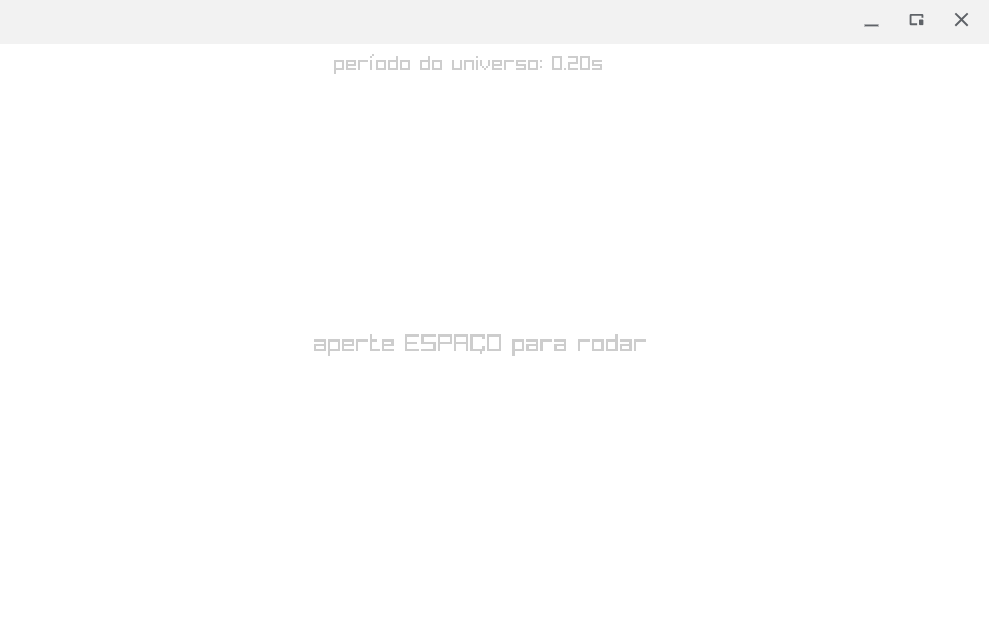
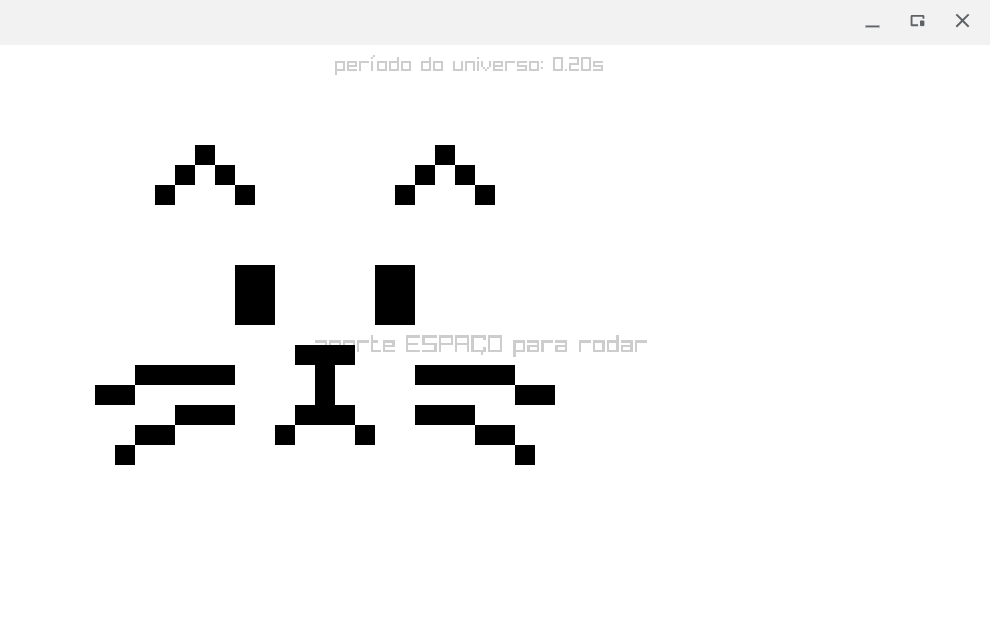
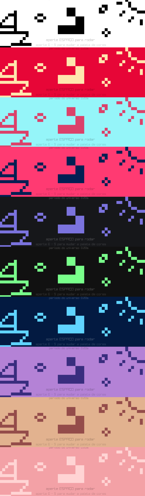

# O Jogo da Vida de um Marinheiro

A vida é feita de altos e baixos, zeros e uns, e com nós marinheiros as coisas não são diferentes. Para sua sorte, este capítulo será um dos grandes altos da sua história! No último mas não menos importante capítulo desta aventura, iremos recriar a obra mais famosa de _John Conway_: **O Jogo da Vida**. Nossos tópicos desta vez serão:

- O que é o Jogo da Vida
- As Regras do Jogo
- Como Implementá-lo com Raylib
- Tornando-o mais bonito :)

Agora chega de papo, vamos lutar!!

## O que é o Jogo da Vida

O que é a vida? ~Potência em busca de potência.~ Boa pergunta! Infelizmente não sei a resposta, mas sei o que é o [Jogo da Vida](https://pt.wikipedia.org/wiki/Jogo_da_vida). Este foi um Autômato Celular criado pelo matemático John Conway, em busca de criar um sistema que possibilitasse não apenas o surgimento de grande complexidade a partir de regras simples, mas também a construção de uma máquina que se auto-replicasse. O "jogo" ficou tão famoso e é tão intrigante que até hoje, mais de 50 anos depois, ainda é usado em pesquisas de matemática, biologia e até mesmo filosofia.

Para compreendermos melhor, precisamos primeiro entender o que é um Autômato Celular (AC). Basicamente, o que temos é uma grade de células (no nosso caso uma grade quadriculada) na qual cada célula tem um número finito de estados possíveis (**viva** ou **morta**, no jogo da vida). A execução de um AC é dada em "passos", ou "ciclos de clock", como preferir chamar. Ou seja, a cada X unidades de tempo, o estado de todas as células na grade serão atualizados de acordo com algum conjunto de regras. O conjunto de regras que rege o Jogo da Vida será explicado agora.

## As Regras do Jogo

A cada iteração do jogo da vida, as regras que determinam se uma célula vai ficar viva ou morta são as seguintes:

1. Células mortas com exatamente 3 vizinhos vivos tornam-se vivas.
2. Células vivas com menos de 2 vizinhos vivos morrem por isolamento.
3. Células vivas com mais de 3 vizinhos vivos morrem por superpopulação.
4. Células vivas com dois ou três vizinhos vivos permanecem vivas.

> Aqui, a palavra "vizinhos" diz respeito às 8 células ao redor (incluindo as diagonais) da que estamos analisando.

Perceba que as regras são extremamente simples, e ainda assim é possível criar estruturas **extremamente** complexas neste jogo, estruturas tão complexas que parecem estar vivas (por isso o nome do jogo).

Antes de o implementarmos, seria legal se você visse o jogo rodando e conhecesse ele mais de perto. Para isso, recomendo que você veja [este vídeo](https://www.youtube.com/watch?v=R9Plq-D1gEk) e brinque um pouco com o jogo [neste site](https://playgameoflife.com/).

Enfim, simbora lá!

## Como Implementá-lo em Raylib

Para começar, vamos importar os cabeçalhos mais cruciais para este programa:

``` C
#include "raylib.h"
#include <math.h>
#include <stdbool.h>
```

A biblioteca `math.h` será usada por conta da função `floor()`, e o `stdbool.h` nos dará o tipo `bool`, para que células vivas sejam marcadas como `true` e células mortas como `false`.

Feito isso, precisamos definir alguns dados e variáveis globais que serão importantes ao longo do programa. Entre eles, estão:

``` C
#define ESPACO_EXTRA 10
#define LARGURA_UNIVERSO 50 + ESPACO_EXTRA * 2
#define ALTURA_UNIVERSO 30 + ESPACO_EXTRA * 2
const int largura_janela = 1000;
const int altura_janela = 600;
const int tamanho_celula = 20;
bool universo[ALTURA_UNIVERSO][LARGURA_UNIVERSO] = { 0 };
bool rodando = false;
float periodo_universo = 0.2f;
float timer_universo = 0.0f;
```

Aqui vai uma explicação do que é cada um e a motivação por trás deles:

- `LARGURA_UNIVERSO` e `ALTURA_UNIVERSO`: é a altura e a largura de nossa grade dada em número de células. Ou seja, nossa grade terá 70 células de largura e 50 de altura.
- `ESPACO_EXTRA`: o espaço extra existe para que, além das células visíveis para o jogador (50 de largura e 30 de altura), existam outras que ficam para fora da tela. Estas células extras servirão para que o que acontece na fronteira entre o visível e o invisível (os limites da janela) não fique esquisito por falta de células além daquele ponto. Ou seja, com o espaço extra, os comportamentos esquisitos no limite do "universo" ficarão fora da tela e não afetarão muito as células que o jogador vê.
- `largura_janela` e `altura_janela`: são de fato o tamanho da janela do jogo em pixels.
- `tamanho_célula`: é o tamanho de uma célula em pixels (tanto a largura quanto a altura, pois células são quadradas).
- `universo`: é uma array bidimensional (uma matriz, ou **grade**) de _booleanos_. Cada booleano representa o estado de uma célula. Ou seja, o `universo` é o estado da simulação; do autômato celular. Setando ele para `{ 0 }`, ele é inicializado com todos os valores como `false`, então todas as células começam mortas ao executarmos o jogo, como é o esperado.
- `rodando`: nos diz se o mundo está sendo atualizado ou se está em pause.
- `periodo_universo`: é o tempo em segundos que nós esperaremos entre uma atualização do universo e outra.
- `timer_universo`: é um cronômetro que nos diz quanto tempo se passou desde a última atualização do universo. Quando ele chegar ao valor definido por `periodo_universo`, significa que chegou a hora de dar um passo na simulação.

Uffaaa... Até que é bastante coisa, mas vamos lá! 

Podemos partir para o nosso `main`. Nele, começaremos criando a janela e definindo o FPS alvo:

``` C
int main(void) {
    InitWindow(largura_janela, altura_janela, "Jonyski's Game of Life");
    SetTargetFPS(60);

    // o resto do jogo virá aqui

    return 0;
}
```

Depois, gostariamos de pelo menos renderizar algo na tela. Não sei, talvez todas as células (brancas as que estiverem mortas e pretas as que estiverem vivas) e um textinho escrito "aperte ESPAÇO para rodar". Bom, para isso, precisaremos definir a cor das células e do texto. Então no escopo global faremos o seguinte:

``` C
Color cor_celula_morta = {255, 255, 255, 255};
Color cor_celula_viva = {0, 0, 0, 255};
Color cor_texto_forte = {0, 0, 0, 50};
Color cor_texto_fraco = {0, 0, 0, 32};
```

Como dito antes, definimos a cor das células mortas para ser branco (`{255, 255, 255, 255}`) e a das células vivas para ser preto (`{0, 0, 0, 255}`). Além disso, também definimos dois tons de cinza para escrever textos, um mais escuro, para textos mais importantes, e outro mais claro, para textos mais discretos.

Com isso, podemos partir para desenhar algo na tela.

``` C
int main(void) {
  InitWindow(largura_janela, altura_janela, "Jonyski's Game of Life");
  SetTargetFPS(60);
  ClearBackground(cor_celula_morta);

  while (!WindowShouldClose()) {
    BeginDrawing();
    ClearBackground(cor_celula_morta);
    DrawText("aperte ESPAÇO para rodar", 320, 288, 24, cor_texto_forte);
    DrawText(TextFormat("período do universo: %02.02fs", periodo_universo),
             340, 10, 20, cor_texto_forte);

    EndDrawing();
  }
  CloseWindow();

  return 0;
}
```

Aqui, estamos fazendo uso de algumas funções que já vimos no capítulo anterior, como `ClearBackground` e `DrawText`. Rodando o programa neste estado, você verá o seguinte:



Nada de mais por enquanto. Mas aqui começa a coisa interessante. Bora fazer com que quando o jogador clique com o mouse na tela, a célula que ele atingir mude de estado (vá de morta para viva ou vice-versa). Para isso, teremos que lidar com inputs do mouse, o que será feito com a função do Raylib chamada `IsMouseButtonPressed(button)`, que nos diz se no frame atual o botão `button` do mouse foi apertado.

Bora então criar uma função que lida com os clicks do mouse para nós:

``` C
void trata_click() {
    if (IsMouseButtonPressed(MOUSE_LEFT_BUTTON)) {
        Vector2 posicao_click = GetMousePosition();
        int x = floor(posicao_click.x / tamanho_celula) + ESPACO_EXTRA;
        int y = floor(posicao_click.y / tamanho_celula) + ESPACO_EXTRA;
        inverte_celula(x, y);
    }
}

void inverte_celula(int x, int y) {
    universo[y][x] = !universo[y][x];
}
```

> Não se esqueça de colocar os protótipos destas funções acima do main para que elas fiquem acessíveis

Como você pode ver, o procedimento é relativamente simples: vemos se o botão esquerdo do mouse foi pressionado (o enum `MOUSE_LEFT_BUTTON` é providenciado pelo Raylib), se este for o caso, invertemos o estado da célula. A fórmula que usamos para descobrir os índices `x` e `y` da célula que foi atingida com o click pode parecer estranha a primeira vista, mas o que estamos fazendo é:

- Dividindo a coordenada do click pelo tamanho de uma célula, o que nos dará um número de `0` a `50` no eixo X e de `0` a `30` no eixo Y;
- O `floor` destes números representam os índices da célula que foi atingida na região visível da grade (o que fica dentro dos limites da janela), mas desconsideram os espaços extras que adicionamos antes;
- Para resolver isso, adicionamos `ESPACO_EXTRA` nos resultados, para ter no final números de `10` a `60` no eixo X e de `10` a `40` no eixo Y, que são de fato as células que o jogador deveria conseguir atingir.

Agora, precisamos ser capazes de renderizar o nosso universo de fato, pois as mudanças de estado das células não estão sendo refletidas graficamente. Para isso, usaremos a seguinte função:

``` C
void renderiza_universo() {
    for (int i = ESPACO_EXTRA; i < ALTURA_UNIVERSO - ESPACO_EXTRA; i++) {
        for (int j = ESPACO_EXTRA; j < LARGURA_UNIVERSO - ESPACO_EXTRA; j++) {
        if (universo[i][j]) {
            int x = j - ESPACO_EXTRA;
            int y = i - ESPACO_EXTRA;
            DrawRectangle(x * tamanho_celula, y * tamanho_celula, tamanho_celula,
                        tamanho_celula, cor_celula_viva);
        }
        }
    }
}
```

Tudo o que ela faz é iterar pelas células que são visíveis e desenhar quadrados pretos (com a função `DrawRectangle`, do Raylib) onde há células vivas. Agora só precisamos chamar nossas novas funções no loop do `main` e como resultado conseguiremos editar a grade livremente:

``` C
  while (!WindowShouldClose()) {
    BeginDrawing();
    // bla bla bla...

    trata_click();
    renderiza_universo();

    EndDrawing();
  }
```



Beleza, nossas células estão vivendo felizes e formando desenhos de gatinhos, mas cadê o movimento? Cadê a VIDA?! É isso que veremos agora. O que precisamos inicialmente é que, quando o jogador aperte espaço, a simulação comece a rodar. Para cuidar disso, criaremos uma função que trata cliques do teclado:

``` C
void trata_teclagem() {
  int tecla = GetKeyPressed();
    if(tecla == KEY_SPACE) {
        rodando = !rodando;
    }
}
```

Aqui, a função `GetKeyPressed()` retorna a tecla que foi pressionada no último frame (caso haja alguma). Em teoria a gente teria que chamar esta função múltiplas vezes para caso mais de uma tecla tenha sido apertada ao mesmo tempo, mas aqui as boas práticas são ignoradas com classe. Enfim, chamaremos esta função no loop do `main` como sempre. Agora, quando apertarmos espaço, o booleano `rodando` alternará entre o estado de execução e de pausa. Se ele estiver em modo de execução (`true`), queremos que o temporizador do universo seja atualizado e que toda vez que ele atingir o período do universo as células sejam atualizadas. Portanto, ainda no loop adicionaremos o seguinte trecho:

``` C
if (rodando) {
    timer_universo += GetFrameTime();
        if (timer_universo >= periodo_universo) {
        atualiza_universo();
        timer_universo = 0.0f;
    }
}
```

Bem simples, fazemos uso da função `GetFrameTime`, que nos dá o tempo decorrido no último frame para atualizar o timer, e então chamamos uma função de atualização do universo caso tenha chegado a hora. O corpo da função `atualiza_universo` (que veremos agora) é onde fica o coração do jogo da vida - é onde são aplicadas as regras do autômato.

``` C
void atualiza_universo() {
    // criando uma cópia do universo, para podermos alterar o original sem afetar o estado passado
    bool universo_paralelo[ALTURA_UNIVERSO][LARGURA_UNIVERSO];
    for (int i = 0; i < ALTURA_UNIVERSO; i++) {
        for (int j = 0; j < LARGURA_UNIVERSO; j++) {
            universo_paralelo[i][j] = universo[i][j];
        }
    }

    // atualizando o universo real
    int vizinhos = 0;
    for (int i = 0; i < ALTURA_UNIVERSO; i++) {
        for (int j = 0; j < LARGURA_UNIVERSO; j++) {
        vizinhos = conta_vizinhos(universo_paralelo, j, i);
        // aplicando as regras do jogo da vida
        if (universo[i][j] && (vizinhos < 2 || vizinhos > 3))
            universo[i][j] = false;
        else if (vizinhos == 3)
            universo[i][j] = true;
        }
    }
}
```

A primeira coisa curiosa é que nós precisamos criar um "universo paralelo" que salve uma cópia do estado atual das células antes de atualizá-las. Se não fizermos isso, as atualizações de células no passo atual vão afetar umas às outras, criando comportamentos estranhos que não fazem parte do jogo da vida; queremos atualizar todas as células **simultaneamente**, então atualizações de um ciclo não podem afetar o próprio ciclo. Depois, passamos para o loop que de fato atualiza as células. Usamos o universo paralelo para contar _quantos vizinhos_ cada célula tem, e então aplicamos as regras do jogo. Lembrando que as regras são:

1. Células mortas com exatamente 3 vizinhos vivos tornam-se vivas.
2. Células vivas com menos de 2 vizinhos vivos morrem por isolamento.
3. Células vivas com mais de 3 vizinhos vivos morrem por superpopulação.
4. Células vivas com dois ou três vizinhos vivos permanecem vivas.

Perceba que a regra 4 não estabelece uma mudança de estado, então ela é "omitida" no código (seria redundante setar uma célula pra `true` se ela já é `true`). Sendo assim, a primeira condicional diz respeito às regras 2 e 3, e a segunda condicional diz respeito à regra 1.

Só nos resta então implementar a função `conta_vizinhos`. Como você deve imaginar, sua implementação é bem tranquila, nós iteramos pelos 8 vizinhos ao redor de uma célula e toda vez que ele estiver vivo, somamos 1 a um contador.

``` C
int conta_vizinhos(bool universo[ALTURA_UNIVERSO][LARGURA_UNIVERSO], int x, int y) {
    int numero_vizinhos = 0;
    for (int i = -1; i <= 1; i++) {
        for (int j = -1; j <= 1; j++) {
        // a própia célula não pode ser considerada um vizinho dela mesma
        if (i == 0 && j == 0)
            continue;

        int nx = x + j;
        int ny = y + i;

        // precisamos garantir que o vizinho não está fora da grade
        if (nx >= 0 && nx < LARGURA_UNIVERSO && ny >= 0 && ny < ALTURA_UNIVERSO) {
            numero_vizinhos += universo[ny][nx];
        }
        }
    }
    return numero_vizinhos;
}
```

> Lembre-se que `true` vale `1` e `false` vale `0`, então `numero_viznhos += universo[ny][nx]` só incrementa o contador se o vizinho estiver vivo.

E Voilá! Rodando este código você pode ver que apertar espaço faz as coisas se moverem como bactérias em uma colônia, crianças em um parque, baleias no oceano, e capoeiristas em uma roda (?). Aleluia irmãooooooss!!!!! Infelizmente, imagens que eu coloque aqui para ilustrar o programa rodando não mostrarão movimento, então rode o código você mesmo, seu safado!

Para deixar o jogo mais completinho, bora fazer com que o jogador possa controlar o período do universo. Se ele apertar `-`, o tempo ficará mais lento, e se ele apertar `+`, o tempo ficará mais rápido. Também seria legal o jogador poder só segurar a tecla ao invés de precisar ficar clicando várias vezes se quiser mudar muito o tempo, então vamos cuidar disso também. Para começar, vamos definir um cooldown para o efeito de segurar a tecla e um timer que conte quanto tempo desde a última mudança de período:

``` C
float timer_teclagem = 0.0f;
float cooldown_periodo = 0.12f;
```

Depois, bora botar no `main` a atualização desse timer a cada frame:

``` C
timer_teclagem += GetFrameTime();
```

Por fim, vamos modificar a função `trata_teclagem` para cuidar do input no `+` e `-`.

``` C
void trata_teclagem() {
    int tecla = GetKeyPressed();
    switch (tecla) {
    // executar/pausar
    case KEY_SPACE:
        rodando = !rodando;
        break;
    // controlar o período
    case KEY_MINUS:
        periodo_universo += 0.02;
        timer_teclagem = -0.4f;
        break;
    case KEY_EQUAL:
        if (periodo_universo - 0.02 >= 0.02)
        periodo_universo -= 0.02;
        timer_teclagem = -0.4f;
        break;
    }

    if (timer_teclagem >= cooldown_periodo) {
        if (IsKeyDown(KEY_MINUS))
            periodo_universo += 0.02;
        if (IsKeyDown(KEY_EQUAL))
            if (periodo_universo - 0.02 >= 0.02)
                periodo_universo -= 0.02;
        timer_teclagem = 0.0f;
    }
}
```

> `KEY_EQUAL` é o que representa o `+`, já que ele fica na mesma tecla que o `=`.

Aqui, usamos mais uma função nova do Raylib: a `IsKeyDown()`. Ela checa se uma tecla está pressionada, mas não necessariamente se ela foi apertada no frame atual. Assim, quando a tecla for apertada da primeira vez, o período do universo será atualizado imediatamente e teremos um delay mais longo (por setar o timer para `-0.4`), mas se continuarmos pressionando, o período continuará sendo atualizado e dessa vez com intervalos mais curtos.

É isso ae, rode o jogo e se divirta.

## Tornando-o mais bonito :)

Não, nós não **te** tornaremos mais bonito, ~você já é bonito de+~ iremos tornar nosso jogo mais bonito. Como? Simples: iremos adicionar diferentes paletas de cores que o jogador pode ativar usando as teclas 0 a 9. Para isso, começaremos definindo uma lista de paleta de cores, com uma cor para células vivas e outra para células mortas, e uma paleta de temas para fontes, com tema escuro e claro:

``` C
typedef enum { LIGHT, DARK } TemaFonte;

TemaFonte temas_fonte[10] = {DARK,  DARK,  DARK, DARK, LIGHT,
                             LIGHT, LIGHT, DARK, DARK, DARK};
Color paletas[10][2] = {
    {(Color){255, 255, 255, 255}, (Color){0, 0, 0, 255}},        // vida
    {(Color){231, 6, 55, 255}, (Color){255, 230, 174, 255}},     // solar
    {(Color){149, 245, 249, 255}, (Color){219, 65, 106, 255}},   // sonho
    {(Color){255, 58, 114, 255}, (Color){2, 31, 83, 255}},       // cereja
    {(Color){22, 23, 26, 255}, (Color){123, 115, 222, 255}},     // noite
    {(Color){17, 17, 17, 255}, (Color){121, 255, 139, 255}},     // hacker
    {(Color){3, 26, 65, 255}, (Color){96, 212, 255, 255}},       // oceano
    {(Color){180, 130, 214, 255}, (Color){57, 45, 126, 255}},    // mirtilo
    {(Color){226, 178, 143, 255}, (Color){148, 76, 74, 255}},    // amora
    {(Color){243, 161, 166, 255}, (Color){255, 212, 212, 255}}}; // pêssego
```

Sendo assim, queremos que quando o jogador aperte `0`, ele ative a paleta de cores e tema do índice `0`, quando aperte `1` ele ative a paleta e o tema seguinte, e assim em diante. Fazer isso é fácil, basta que adicionemos a seguinte seção à função `trata_teclagem`:


``` C
if (tecla >= KEY_ZERO && tecla <= KEY_NINE) {
    int idx = tecla - KEY_ZERO;
    cor_celula_morta = paletas[idx][0];
    cor_celula_viva = paletas[idx][1];
    trocaTemaFonte(temas_fonte[idx]);
}
```

Aqui, fazemos proveito do fato de que os enums do `KEY_ZERO` ao `KEY_NINE` possuem valores que vão de `48` a `57`, como você pode conferir no [código fonte](https://github.com/raysan5/raylib/blob/master/src/raylib.h) do Raylib. A função `trocaTemaFonte` ainda não existe, então bora definir ela:

``` C
void trocaTemaFonte(TemaFonte tema) {
    switch (tema) {
    case DARK:
        cor_texto_forte = (Color){0, 0, 0, 50};
        cor_texto_fraco = (Color){0, 0, 0, 32};
    break;
    case LIGHT:
        cor_texto_forte = (Color){255, 255, 255, 50};
        cor_texto_fraco = (Color){255, 255, 255, 32};
    }
}
```

E como detalhe final, bora colocar um texto na tela indicando para o jogador como usar as paletas de cor:

``` C
DrawText("aperte 0 - 9 para mudar a paleta de cores", 250, 322, 22, cor_texto_fraco);
```

FIMMM!!! Se você rodar o jogo e apertar as teclas de 0 a 9, conseguirá alternar entre todas essas lindas paletas:




## Conclusão

Nossos sinceros parabéns e agradecimentos por você ter chegado até aqui! O caminho pode ter sido difícil, mas você conseguiu :D

Esperamos que tenha gostado do que viu neste breve curso introdutório. O que exploramos nesta jornada foi o básico tanto do C quanto do Raylib; o oceano é grande, explorá-lo leva tempo. Contudo, isto não significa que o que aprendemos é pouca coisa, estes conhecimentos são fundamentais e críticos para a vida de um marinheiro, então celebre esta vitória!

Para dar um fim à este capítulo, bora assistir a vida passar:

<video src="../imagens/video_final.mp4" controls="controls" style="max-width: 100%;"> </video>
